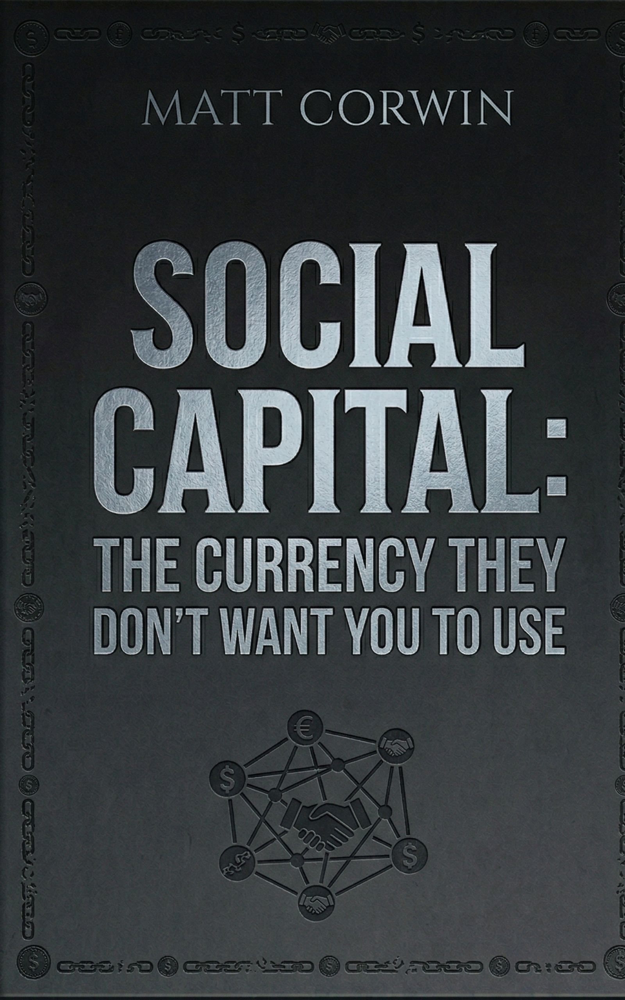

> **[Download the full audiobook (2h 55m)](https://github.com/alanwatts07/social-capital-book/releases/download/v1.0/social_capital_audiobook.mp3)** — read by the author

# Before We Start

## Why This Book Exists

Nobody wrote this for me. I wish someone had.

I spent years doing it the wrong way. Grinding alone. Isolating. Telling myself I didn't need anyone. I took care of my mom while my family fell apart. I sat in a room teaching myself AI-augmented development for four years with zero social life, convinced that productivity was the same thing as progress. I was broke, I was alone, and I thought that was just the price of building something.

Then I walked into a bar nobody knew about because I needed to get out of a depressing house. I started showing up every day it was open. I helped the bartenders because I could. Within three months I had more genuine connections than I'd built in years — and I was still broke. Nothing changed except that I started being present, being useful, and paying attention to who gave back.

That's it. That's the whole secret. And it made me angry — not at myself, but at every podcast, every influencer, every algorithm that spent years telling me the answer was to grind harder and need people less. They were wrong. They were profiting from my isolation. And they're doing the same thing to you right now.

I wrote this because the strategy that saved me is almost free, backed by actual mathematics, and nobody is teaching it. Not like this. Not honestly. Not from the perspective of someone who was alone in a laundry room and a bar stool and figured it out the hard way.

If someone had handed me this book ten years ago, a lot of the hard parts would have been less hard. I can't go back. But I can write it down so you don't have to figure it out by accident.

---

## Who This Is For

This book is for everyone. Introvert, extrovert, somewhere in between. Broke, comfortable, starting over. Twenty years old or fifty. It doesn't matter. The principles in here work because they're built on how humans have always worked — cooperation, reciprocity, trust.

That said, I write from my own experience. I'm an introvert. I've built most of what I have from barstools and local spots with next to no money. So you'll notice the examples lean that way — toward quiet people, small budgets, and neighborhood-level community. That's not because this only works for people like me. It's just the lens I know best.

If your version of this looks different — if your "bar" is a gym, a mosque, a Discord server, a community garden — the strategy is the same. Show up. Be generous. Pay attention to who gives back. Prune the rest.

Take what's useful. Leave what isn't. Make it yours.
